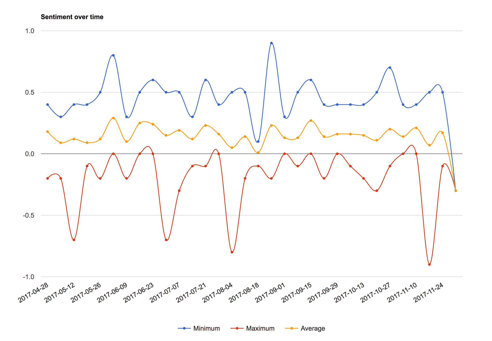

# Weekly Report Sentiment Analysis
Provides a GUI for sentiment analysis from PA weekly reports



## Features
Not feature complete, needs much work - but a starter. Shows a graph overall or per customer.

## Running
```
mvn package -DskipTests
cf push sentiment -p target/sentiment-0.0.1-SNAPSHOT.jar --no-start

# optionally bind a database
cf create-service p-mysql 100mb sentimentDB
cf bind-service sentiment sentimentDB

# add oauth2 config from google
cf set-env security.oauth2.client.clientId <<clientID>>
cf set-env security.oauth2.client.clientSecret <<clientSecret>>

# start the app
cf start sentiment
```

## Using
Visit the app, http://sentiment.cfapps.example.com/

To see a specific customer, simply add it as an anchor, e.g. http://sentiment.cfapps.example.com/#myCustomer
